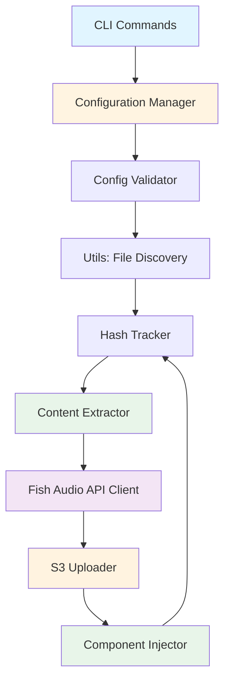
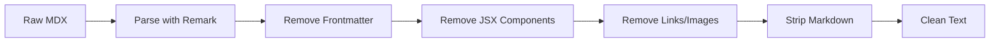
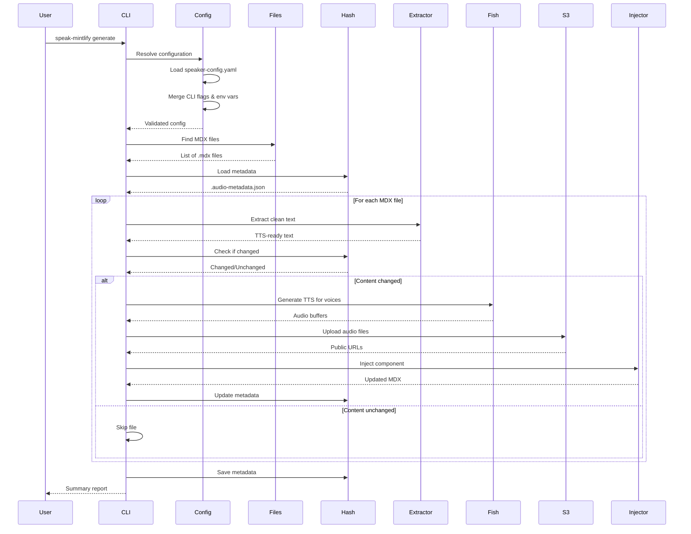
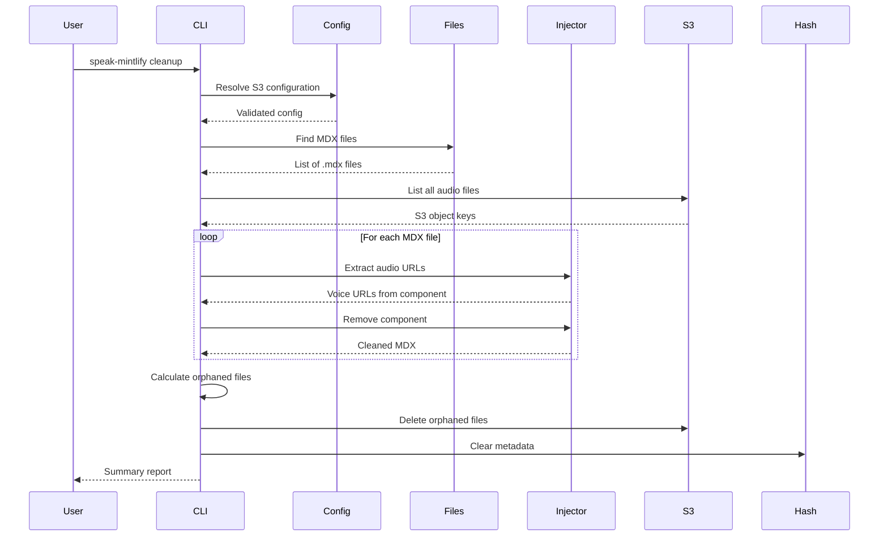

This page provides a comprehensive overview of speak-mintlify's architecture, explaining how the different modules work together to generate and manage audio transcripts for your documentation.

## High-Level Architecture



## Core Modules

speak-mintlify is organized into several core modules, each with a specific responsibility:

### 1. Configuration Manager (`config.ts`)

**Purpose:** Unifies configuration from multiple sources with clear priority.

**Priority Order:**
1. CLI flags (highest priority)
2. Environment variables
3. `speaker-config.yaml` file
4. Default values (lowest priority)

**Key Functions:**
- `loadSpeakerConfig()` - Loads voice and component settings from YAML
- `resolveConfig()` - Merges all config sources and validates required fields

**Configuration Sources:**
```yaml
# speaker-config.yaml
voices:
  voice-abc123: "Sarah"
  voice-def456: "John"

component:
  import: "/snippets/audio-transcript.jsx"
  name: "AudioTranscript"
```

### 2. Content Extractor (`extractor.ts`)

**Purpose:** Converts MDX files into clean, TTS-friendly text.

**Processing Pipeline:**


**Key Features:**
- Uses unified/remark for AST-based processing
- Removes imports, exports, and JSX components
- Preserves paragraph structure and readability
- Cleans up orphaned punctuation

**Key Functions:**
- `extractCleanText()` - Main text extraction function
- `findFrontmatterEnd()` - Locates frontmatter boundary
- `extractFrontmatter()` - Parses YAML frontmatter

### 3. Hash Tracker (`hash-tracker.ts`)

**Purpose:** Tracks content changes to avoid regenerating unchanged files.

**Metadata Storage:**
```json
{
  "getting-started.mdx": {
    "hash": "sha256-hash-of-content",
    "lastUpdated": "2024-03-15T10:30:00Z",
    "voices": [
      {
        "id": "voice-123",
        "name": "Sarah",
        "url": "https://cdn.example.com/audio/getting-started/voice-123.mp3"
      }
    ]
  }
}
```

**Key Functions:**
- `generateHash()` - Creates SHA-256 hash of content
- `loadMetadata()` - Loads `.audio-metadata.json`
- `saveMetadata()` - Persists metadata to disk
- `hasContentChanged()` - Compares hashes to detect changes
- `updateMetadata()` - Updates metadata for a file

### 4. Fish Audio Client (`fish-api.ts`)

**Purpose:** Wrapper around the Fish Audio SDK for TTS generation.

**Key Features:**
- Automatic retry logic with exponential backoff (3 retries)
- Parallel voice generation
- Buffer management for audio data

**Key Functions:**
- `generateTTS()` - Generates audio for a single voice
- `generateMultipleVoices()` - Generates audio for multiple voices in parallel
- `createFishAudioClient()` - Factory function

**Request Flow:**
```typescript
const client = new FishAudioClient(apiKey);
const buffer = await client.generateTTS(text, voiceId);
// Returns: MP3 audio buffer
```

### 5. S3 Uploader (`s3-upload.ts`)

**Purpose:** Handles uploads to S3-compatible storage (AWS S3, Cloudflare R2, MinIO).

**File Organization:**
```
s3://bucket/
└── audio/                    # pathPrefix
    ├── getting-started/      # page slug
    │   ├── voice-123.mp3
    │   └── voice-456.mp3
    └── api-reference/
        ├── voice-123.mp3
        └── voice-456.mp3
```

**Key Functions:**
- `uploadAudio()` - Uploads single audio file
- `uploadMultipleVoices()` - Uploads multiple files in parallel
- `listAllAudioFiles()` - Lists all files with pagination
- `deleteMultiple()` - Batch deletes files
- `extractKeyFromUrl()` - Converts public URL to S3 key

**URL Generation:**
```typescript
// Input: docs/getting-started/introduction.mdx
// Output: audio/getting-started-introduction/voice-123.mp3
// Public URL: https://cdn.example.com/audio/getting-started-introduction/voice-123.mp3
```

### 6. Component Injector (`injector.ts`)

**Purpose:** Injects audio player components into MDX files using AST manipulation.

**Injection Strategy:**
1. Parse MDX content into AST
2. Locate import section (after frontmatter)
3. Find first content node (heading/paragraph)
4. Insert import statement
5. Insert hash comment and component

**Example Output:**
```mdx
---
title: 'Getting Started'
---

import { AudioTranscript } from '/snippets/audio-transcript.jsx';

{/* speak-mintlify-hash: a1b2c3d4... */}
<AudioTranscript voices={[
  {
    "id": "voice-123",
    "name": "Sarah",
    "url": "https://cdn.example.com/audio/getting-started/voice-123.mp3"
  }
]} />

# Getting Started

Your documentation content...
```

**Key Functions:**
- `injectAudioComponent()` - Adds audio component to MDX
- `extractExistingAudioData()` - Reads existing component from AST
- `hasAudioComponent()` - Checks if component exists
- `removeAudioComponent()` - Removes component from MDX

### 7. Utilities (`utils.ts`)

**Purpose:** Common file operations and MDX discovery.

**Key Functions:**
- `findMDXFiles()` - Discovers MDX files using glob patterns
- `readFile()` / `writeFile()` - File I/O operations
- `loadSpeakIgnore()` - Loads `.speakignore` patterns

**Default Ignore Patterns:**
```
node_modules/**
dist/**
.git/**
snippets/**
```

### 8. Validators (`validators.ts`)

**Purpose:** Validates configuration for each command.

**Key Functions:**
- `validateGenerateConfig()` - Ensures Fish API key and voices are configured
- `validateCleanupConfig()` - Validates S3 configuration

## Data Flow

### Generate Command Flow



### Cleanup Command Flow



## Error Handling

speak-mintlify implements robust error handling at multiple levels:

### Retry Logic

**Fish Audio API calls** use `p-retry` with:
- 3 retry attempts
- Exponential backoff
- Console warnings on failed attempts

### Validation

**Configuration validation** happens early:
- Missing required fields throw descriptive errors
- Provides guidance on how to set missing values
- Validates voice ID/name array lengths match

### File Operations

**File I/O errors** are handled gracefully:
- Missing `.audio-metadata.json` returns empty metadata
- Missing `speaker-config.yaml` uses defaults
- Missing `.speakignore` uses default patterns

## Performance Optimizations

### Parallel Processing

- Multiple voices generated in parallel per file
- Multiple audio uploads to S3 in parallel
- Batch deletion of S3 objects (up to 1000 at once)

### Change Detection

- SHA-256 hashing prevents unnecessary regeneration
- Only changed files are processed
- Metadata cached in `.audio-metadata.json`

### AST-Based Processing

- Efficient MDX parsing with unified/remark
- Precise component injection and extraction
- No regex-based text manipulation

## File Structure

```
src/
├── types/
│   └── index.ts           # TypeScript type definitions
├── core/
│   ├── config.ts          # Configuration management
│   ├── extractor.ts       # MDX text extraction
│   ├── hash-tracker.ts    # Content change detection
│   ├── fish-api.ts        # Fish Audio API client
│   ├── s3-upload.ts       # S3 storage operations
│   ├── injector.ts        # MDX component injection
│   ├── utils.ts           # File utilities
│   └── validators.ts      # Configuration validators
├── commands/
│   ├── generate.ts        # Generate command
│   └── cleanup.ts         # Cleanup command
└── index.ts               # CLI entry point
```

## Extension Points

speak-mintlify is designed to be extensible:

### Custom Storage Backends

The `S3Uploader` class can be extended to support other storage providers:

```typescript
import { S3Uploader } from 'speak-mintlify/core/s3-upload';

class CustomStorageUploader extends S3Uploader {
  // Override methods for custom storage logic
}
```

### Custom TTS Providers

The `FishAudioClient` interface can be implemented for other TTS services:

```typescript
class CustomTTSClient {
  async generateTTS(text: string, voiceId: string): Promise<Buffer> {
    // Custom TTS logic
  }
}
```

### Custom Components

The component injector supports custom audio player components:

```bash
speak-mintlify generate \
  --component-import "/components/my-player.jsx" \
  --component-name "MyAudioPlayer"
```

## Dependencies

Key dependencies and their purposes:

- **unified/remark** - MDX parsing and AST manipulation
- **fish-audio** - Official Fish Audio SDK
- **@aws-sdk/client-s3** - S3-compatible storage
- **p-retry** - Automatic retry logic
- **glob** - File pattern matching
- **commander** - CLI framework

## Security Considerations

### Secrets Management

- API keys and credentials via environment variables
- No secrets stored in `speaker-config.yaml`
- S3 credentials use AWS SDK's secure credential chain

### Content Safety

- Frontmatter and imports stripped from TTS content
- JSX components removed to prevent code injection
- File paths normalized to prevent directory traversal

### Access Control

- S3 bucket permissions managed externally
- Public URLs configured independently
- No built-in authentication (relies on S3/CDN)

## Best Practices

1. **Use `.speakignore`** to exclude sensitive or auto-generated files
2. **Set up CDN** for S3 public URLs to improve performance
3. **Use environment variables** for credentials (never commit them)
4. **Run with `--dry-run`** first to preview changes
5. **Keep `speaker-config.yaml`** in version control (no secrets)
6. **Add `.audio-metadata.json`** to `.gitignore` if preferred

## Future Architecture Considerations

Potential enhancements for future versions:

- Plugin system for custom extractors and injectors
- Streaming TTS generation for large documents
- Multi-language support with language detection
- Audio caching service to avoid regeneration
- Webhook integration for CI/CD pipelines
- Real-time progress tracking with WebSockets